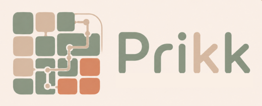

# Prikk Documentation

Prikk is an experimental, design-first distributed version control system built around
block-oriented patch theory. This documentation now covers a full guide and reference section, and
continues to grow as new areas land.

> **About the name.** *Prikk* is the Norwegian word for *dot*. It was chosen because it opens with the
> **p** of *patches*, and because a patch history is exactly that: dots — patches as nodes — connected
> into a DAG.

To install and start using the CLI, see [Install](guide/install.md).

For the current architecture and trust boundaries, start with:

- [Data Model](reference/data-model.md)
- [Trust and Threat Model](reference/trust-threat-model.md)
