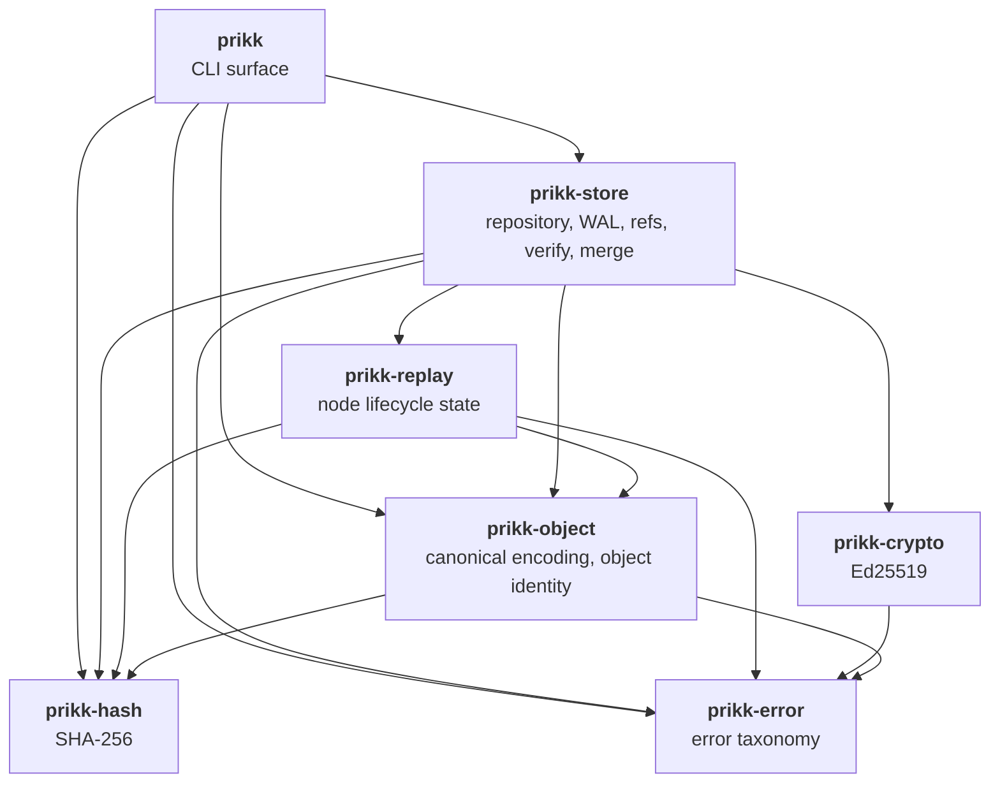
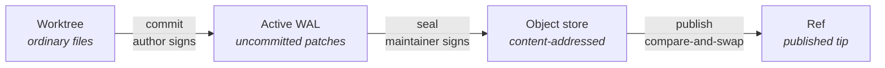

# System Architecture

An overview of how Prikk is put together: which crate owns what, which way dependencies point, and
where the boundaries that matter are enforced.

For the objects themselves and how they change over time, see
[Data Model Relationships and Lifecycle](./data-model-lifecycle.md).

## Crate graph

Seven published crates. Dependencies point strictly downward — there are no cycles, and each crate
depends only on layers beneath it.

| Crate | Owns | Does **not** own |
|---|---|---|
| `prikk-error` | The error taxonomy every layer returns | Anything else — it has no dependencies |
| `prikk-hash` | SHA-256, first-party since DC-55 | Object identity rules |
| `prikk-crypto` | Ed25519 signing and verification | Who is trusted, or when to sign |
| `prikk-object` | Canonical encoding, `ObjectId` derivation, payload shapes and their validation | Storage, I/O, policy |
| `prikk-replay` | Node lifecycle state — what exists, what is tombstoned | Where state is stored |
| `prikk-store` | The repository: object store, WAL, refs, verify, patch algebra, merge, filesystem durability | Command-line parsing and presentation |
| `prikk` | CLI surface, argument parsing, output | Any rule — it delegates every decision downward |

## Dependency boundary, enforced not documented

`prikk-store` may depend on exactly **`getrandom` and `rustix`**; `prikk-crypto` on **`ed25519-dalek`
and `getrandom`**; `prikk-hash` on **`sha2`**. Every other product crate has **no** third-party
dependencies at all.

This is not a convention. It is checked by `prikk-release-policy boundary-check`, which resolves the
real package graph from the root manifest and fails the build on any addition. Adding a dependency to a
product crate is therefore a reviewed decision, not an implementation detail.

## The mutation pipeline

Every change to sealed history follows the same path. Each stage is separately durable, and the
repository is consistent if the process stops between any two of them.

- **commit** turns worktree differences into a signed patch in the active WAL. The **author** signs.
- **seal** persists the WAL's patches as objects and builds a block over them. The **maintainer** signs
  the block. Multiple commits may be queued and sealed together.
- **publish** advances the ref by compare-and-swap against its expected previous state, so a concurrent
  writer cannot be silently overwritten.

The two signatures are separate roles by construction: an author cannot seal, and a maintainer sealing
another author's work never re-signs that author's patches.

## Repository layout

Under `.prikk/`:

| Directory | Holds | Trust |
|---|---|---|
| `objects/` | Content-addressed objects, named by `ObjectId` | **Authoritative** |
| `refs/` | Ref states, the ref log, and recovery notes | **Authoritative** |
| `trust/` | Maintainer trust store — which keys may seal | **Authoritative** |
| `logs/` | Ref-log journal and log records | **Authoritative** |
| `cache/` | Rebuildable derived state | **Never a root of trust** |

The last row is a requirement, not an observation: **NFR-PERF-04** states that caches are rebuildable
and never roots of trust. `BlockSummaryCache` uses the canonical codec for reproducibility but is
explicitly excluded from block identity.

## Where the platform boundary sits

Read-only commands run on Linux, macOS, and Windows, verified continuously in CI. **Mutation is
Linux-only** — 93 `target_os = "linux"` gates across `prikk-store`'s anchored filesystem module.

That is deliberate. DC-37 requires anchored opens that refuse symlink traversal, atomic replacement, and
explicit file and directory durability; those guarantees were implemented against Linux primitives and
have not yet been re-established elsewhere. See [Platform Support](./platform-support.md).

## Verification is the trust boundary

`prikk verify` re-derives rather than trusts: object ids are recomputed from canonical bytes, block state
roots are re-derived from lineage, and a merge block's recorded baseline is re-checked as a genuine
common ancestor of both parents.

Two limits are worth stating plainly, because they define what verification means here:

- Verification confirms **structural and cryptographic** validity. It does not re-derive that a change
  was semantically the *right* change — that rests on the maintainer's signature, uniformly, for merges
  exactly as for ordinary commits.
- Repository-wide **author** trust verification is not yet implemented, so a patch's author signature is
  carried and preserved but not checked repository-wide by `verify`.

## Known architectural costs

| Cost | Status |
|---|---|
| `prikk verify` is roughly **O(N³)** in sealed block count — 34 s at 160 blocks | Tracked, unowned |
| Node lifecycle state grows with cumulative history, not the current tree | Tracked; the project has no theory of forgetting yet |
| Mutation is Linux-only | Being addressed, contract first |

These are recorded in `FINDINGS.md` in the repository rather than left implicit.
