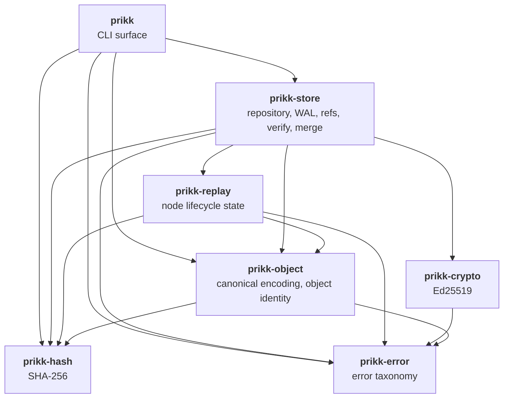
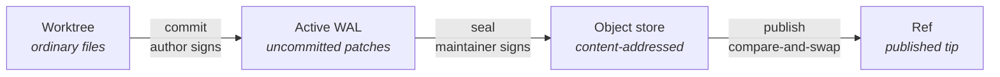

# System Architecture

An overview of how Prikk is put together: which crate owns what, which way dependencies point, and
where the boundaries that matter are enforced.

For the objects themselves and how they change over time, see
[Data Model Relationships and Lifecycle](./data-model-lifecycle.md).

## Crate graph

Seven published crates. Dependencies point strictly downward — there are no cycles, and each crate
depends only on layers beneath it.

| Crate | Owns | Does **not** own |
|---|---|---|
| `prikk-error` | The error taxonomy every layer returns | Anything else — it has no dependencies |
| `prikk-hash` | SHA-256, first-party since DC-55 | Object identity rules |
| `prikk-crypto` | Ed25519 signing and verification | Who is trusted, or when to sign |
| `prikk-object` | Canonical encoding, `ObjectId` derivation, payload shapes and their validation | Storage, I/O, policy |
| `prikk-replay` | Node lifecycle state — what exists, what is tombstoned | Where state is stored |
| `prikk-store` | The repository: object store, WAL, refs, verify, patch algebra, merge, filesystem durability | Command-line parsing and presentation |
| `prikk` | CLI surface, argument parsing, output | Any rule — it delegates every decision downward |

## Dependency boundary, enforced not documented

`prikk-store` may depend on exactly **`getrandom` and `rustix`**; `prikk-crypto` on **`ed25519-dalek`
and `getrandom`**; `prikk-hash` on **`sha2`**. Every other product crate has **no** third-party
dependencies at all.

This is not a convention. It is checked by `prikk-release-policy boundary-check`, which resolves the
real package graph from the root manifest and fails the build on any addition. Adding a dependency to a
product crate is therefore a reviewed decision, not an implementation detail.

## The mutation pipeline

Every change to sealed history follows the same path. Each stage is separately durable, and the
repository is consistent if the process stops between any two of them.

- **commit** turns worktree differences into a signed patch in the active WAL. The **author** signs.
- **seal** persists the WAL's patches as objects and builds a block over them. The **maintainer** signs
  the block. Multiple commits may be queued and sealed together.
- **publish** advances the ref by compare-and-swap against its expected previous state, so a concurrent
  writer cannot be silently overwritten.

The two signatures are separate roles by construction: an author cannot seal, and a maintainer sealing
another author's work never re-signs that author's patches.

## Repository layout

Under `.prikk/`:

| Directory | Holds | Trust |
|---|---|---|
| `objects/` | Content-addressed objects, named by `ObjectId` | **Authoritative** |
| `refs/containers/` | Every ref's own pointer entry and ref-log records, in shared append-only containers | **Authoritative** |
| `trust/` | Maintainer trust store — which keys may seal | **Authoritative** |
| `cache/` | Rebuildable derived state | **Never a root of trust** |

The last row is a requirement, not an observation: **NFR-PERF-04** states that caches are rebuildable
and never roots of trust. `BlockSummaryCache` uses the canonical codec for reproducibility but is
explicitly excluded from block identity.

## Where the platform boundary sits

Read-only commands run on Linux, macOS, and Windows, verified continuously in CI. **Mutation runs on all
three as of 0.21.0** — each platform's durability implementor lives behind one gated dispatch point
(`ACTIVE_DURABILITY`, DC-82), so adding Windows was one more arm there rather than a rewrite of the
mutation layer, which is what the seam was drawn for.

Windows is not a straight equivalent, and the differences are named rather than implied: it has no
`openat`, so anchored resolution is a validated path walk with the anchor's identity confirmed against a
retained handle, and four residual properties are stated in
[platform support](./platform-support.md). The mutation suite runs on all three platforms in CI, and a
repository authored on Linux, mutated on Windows, and verified on Linux is required to produce
byte-identical object ids.

That is deliberate. DC-37 requires anchored opens that refuse symlink traversal, atomic replacement, and
explicit file and directory durability; those guarantees were implemented against Linux primitives
first (`LinuxDurability`), macOS second (`MacosDurability`, DC-81), and Windows third
(`WindowsDurability`, DC-87 Stage 2) — with no reviewed equivalent on any other platform. See
[Platform Support](./platform-support.md) for the per-platform residual gaps, including Windows'
weaker anchoring guarantee in one stated way.

## Where the unsafe-code boundary sits

Every crate in the workspace carries `#![forbid(unsafe_code)]`, applied uniformly through the root
`Cargo.toml`'s `[workspace.lints.rust]` table (`unsafe_code = "forbid"`) and each member's own
`[lints]` / `workspace = true`. The owner's ruling (DC-90) permits at most one workspace crate to be
named as an exception — never inferred from what a crate happens to do — and no crate is named today:
prikk writes no `unsafe` code of its own yet, even though it already *runs* some (`rustix`'s own
internal FFI on Linux and macOS, which `forbid(unsafe_code)` governs code prikk writes, not code it
depends on).

**The boundary is a gate, not a convention.** `release-policy boundary-check`
(`tools/release-policy/src/boundary/unsafe_boundary.rs`) fails the build if a second crate is ever
named exempt, if any non-exempt crate drops workspace lint inheritance, or — the rule that makes an
eventual exemption self-guarding — if the one exempt crate opts out of inheritance without locally
re-declaring `clippy::undocumented_unsafe_blocks = "deny"` in its own manifest. That lint is enabled
once, at the workspace root, specifically because the crate permitted to write `unsafe` is also the
one crate that could otherwise switch its own SAFETY-comment requirement off by deleting a line.

**What the gate cannot see, and the review obligation that covers it instead**, is documented in full
in `unsafe_boundary.rs`'s own module doc — read that before relying on a green `boundary-check` as
proof of anything it doesn't test. In short: FFI-ABI correctness (whether a foreign function
declaration actually matches the real platform ABI) and `SAFETY:` comment *content* are both human
review judgments, not machine-checkable properties, and comment *staleness* — a comment that no longer
justifies the code beneath it after an edit — degrades silently behind a gate that stays green either
way.

## Verification is the trust boundary

`prikk verify` re-derives rather than trusts: object ids are recomputed from canonical bytes, block state
roots are re-derived from lineage, and a merge block's recorded baseline is re-checked as a genuine
common ancestor of both parents.

Two limits are worth stating plainly, because they define what verification means here:

- Verification confirms **structural and cryptographic** validity. It does not re-derive that a change
  was semantically the *right* change — that rests on the maintainer's signature, uniformly, for merges
  exactly as for ordinary commits.
- `verify` enforces repository-wide **author** verification (DC-53): every reachable Patch's AUTHOR
  signature is cryptographically checked against recorded key material. This remains
  trust-on-first-use continuity, not first-contact authenticity — there is no independent
  repository-wide AUTHOR *trust policy* (allowlist or revocation) the way MAINTAINER keys have one; see
  [trust and threat model](./trust-threat-model.md).

## Known architectural costs

| Cost | Status |
|---|---|
| ~~`prikk verify` is roughly **O(N³)** in sealed block count — 34 s at 160 blocks~~ **Resolved 2026-08-18.** `verify` is linear: **27.04 ms at 160 blocks**, per-doubling ratio **1.97** | Closed, and held by a gate — see below |
| Node lifecycle state grows with cumulative history, not the current tree | Tracked; the project has no theory of forgetting yet |
| Windows mutation's anchored path resolution cannot close the inter-component TOCTOU window `openat` closes on Linux/macOS | Accepted, documented ([platform support](./platform-support.md)) — requires a concurrent local attacker to matter |
| DC-76's negative controls are only partly demonstrated on Windows, for the eight guarantees that remain (G5 retired in DC-98) — see [platform support](./platform-support.md) for the per-guarantee table | Reported per DC-76's own precedent, unowned |
| Commit cost is not yet bounded independently of repository size (NFR-PERF-01) | Reduced, still missed |
| Merge complexity scoped to active block size (NFR-PERF-03) is **argued, not benchmarked** | Unowned |
| A text span's identity includes its position among textually- **and** anchor-identical occurrences, recomputed against the buffer in front of it. Correctness therefore rests on an **unstated, unchecked invariant**: that each `EditText` is authored against the state its predecessors produced. Every authoring path in this codebase upholds it — **no user-facing path reaches the failure** — but a sequence violating it is refused as malformed evidence rather than reported as what it is | Latent; found 2026-09-03 by the patch-algebra property tests; owned by RFC 134 |

These are recorded rather than left implicit. The findings register they once pointed at was
retired deliberately — reviews carry findings while they are live, and documentation and RFCs
carry what outlives them — so this table, `ROADMAP.md`'s open-work index, and the RFCs themselves
are where they live now.

## What the block design trades, and what it does not

Patch-theoretic systems have a known failure mode: **Darcs's exponential merge**, which arises because
its patches are *context-dependent*. Reordering two of them requires **commuting** one into an equivalent
that applies in the other's context, and resolving conflicts means searching those orderings.

**Prikk cannot have that failure mode, by construction.** Its operations are context-free — every
operation names a stable `NodeId`, and `EditText` identifies its span by content anchors with
`presentation_hint_line` explicitly excluded from algebraic identity. A patch transports between
lineages **without transformation**, which is also why a merge can adopt patches byte-identically with
their author signatures intact. There is no commutation search to explode.

The second half is deliberate refusal rather than cleverness: the patch algebra proves confluence only
for a **conservative subset** it can prove, and returns a typed conflict witness for everything else.
**Cost is bounded by refusing hard cases, not by exploring them.** Sealing history into immutable blocks
then keeps that reasoning confined to the active working set, which is itself capped (NFR-PERF-02).

**The trade was real, it was measured, and it has been paid. That history is worth stating plainly:**

> **The mechanism that bounds patch cost also created prikk's own cost.** History is sealed into a
> chain carrying state roots, and `verify` must re-derive those roots to check them. The first
> implementation re-derived each block's state **from genesis**, so verifying the block at position
> *i* cost O(i²) and the whole chain O(N³) — about 34 seconds at 160 blocks.

**Prikk did not inherit Darcs's problem. It had a different one, and it lived in the verification path
rather than the merge path** — which mattered more, not less, because verification is this project's
central claim in a way that merge throughput is not. **It was found by measurement rather than by
reading the design, and it is now fixed.**

`verify` derives each block's state **once, forward from its already-verified parent, memoizing as it
goes** — never from genesis per block — and checks the result against that block's recorded state
root. Combined with removing a repeated full-index decode on the same path, the cost is **linear**:
**27.04 ms at 160 blocks, per-doubling ratio 1.97**, against 167.85 ms and ×3.51 at the intermediate
stage.

**The property is held by a gate rather than by a measurement**: `rfc111_index_decode_cost_gate.rs`
fails if `verify`'s full-index-decode count ever grows with repository size again, and it was observed
failing before its fix. **So the block-oriented design's central trade held** — the cost it created
was real, was found, and is now bounded and defended.
