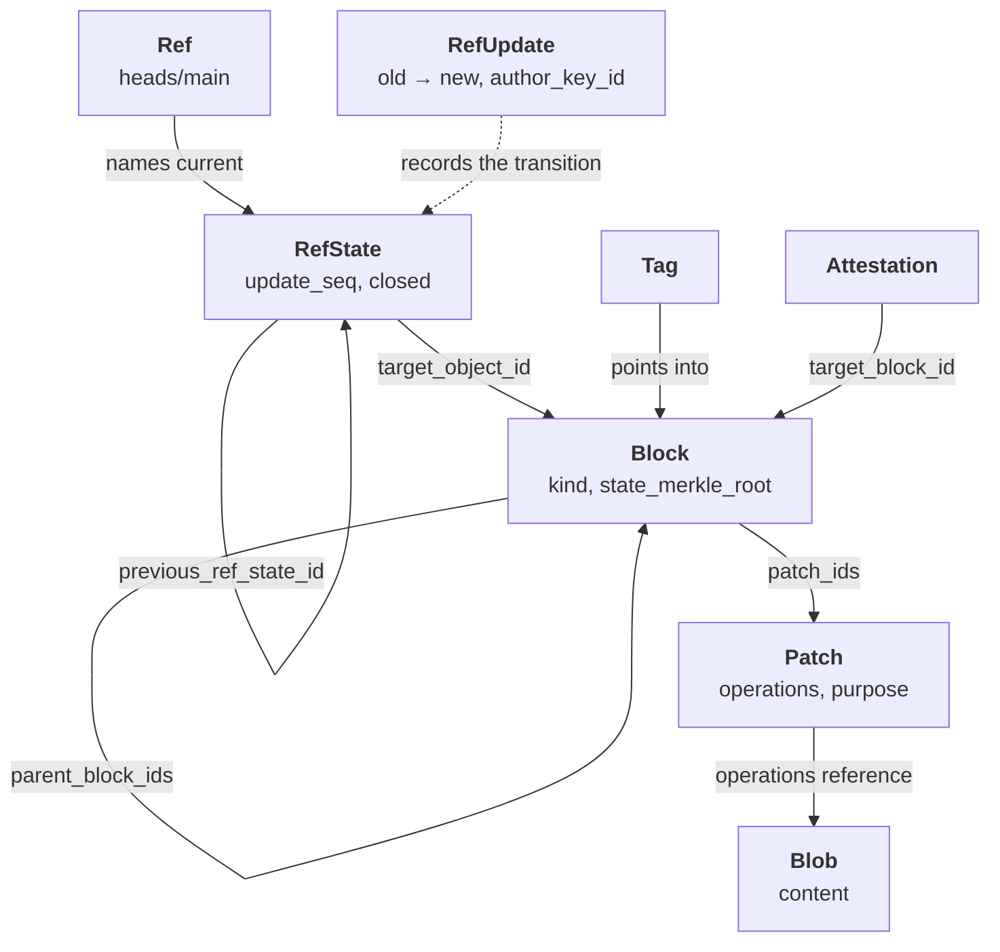
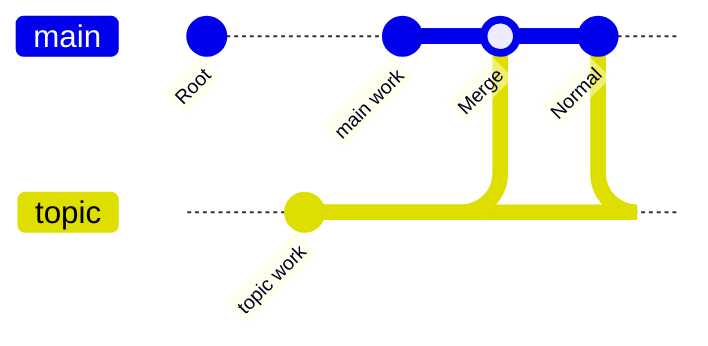
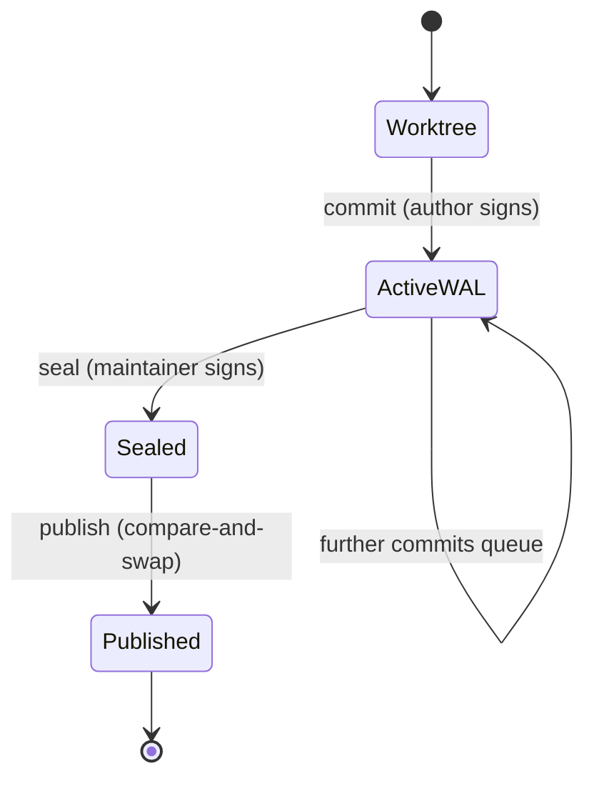
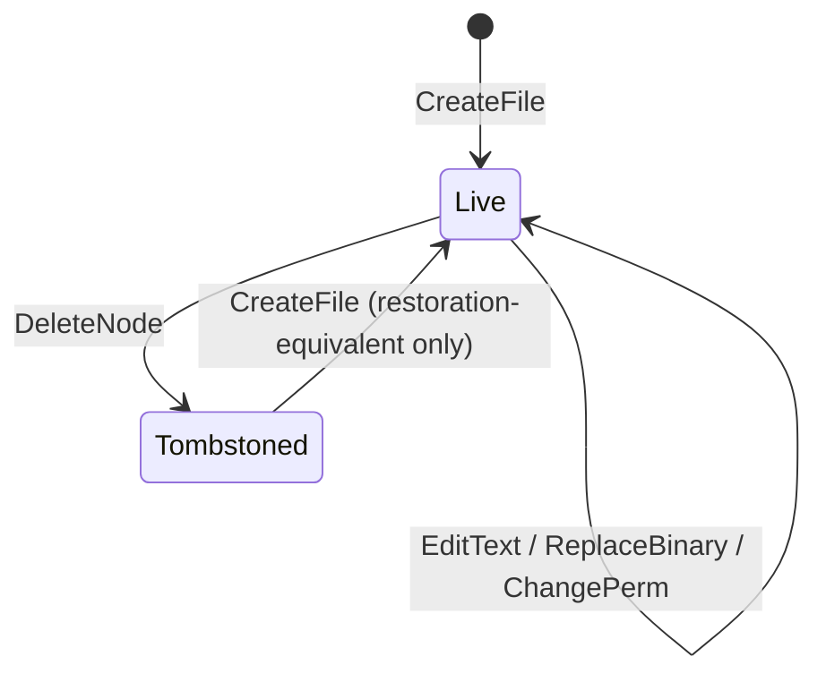
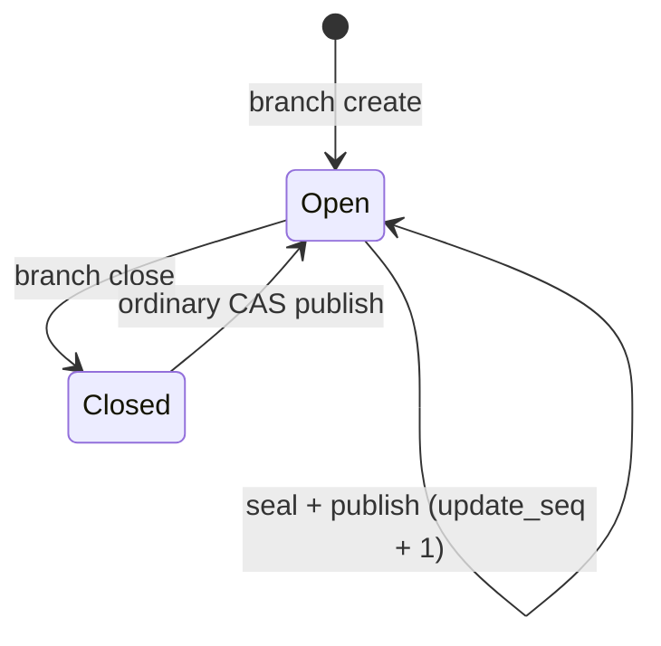

# Data Model Relationships and Lifecycle

How Prikk's objects relate to one another, and how each moves through its states.

This is the *relationship and lifecycle* view. For the per-object field contracts, identity rules, and
their source anchors, see [Data Model](./data-model.md). For the crate layering these objects live in,
see [System Architecture](./architecture.md).

## The object taxonomy

Ten object types. The type code is part of object identity, so an object of one type can never collide
with another type's id.

| Code | Type | Role | Stored in |
|---|---|---|---|
| `0x01` | **Patch** | An authored change: an ordered list of operations | `objects/` |
| `0x02` | **Block** | A sealed group of patches, linked into lineage | `objects/` |
| `0x03` | **RefState** | A ref's state at one point: which block it names | `objects/` |
| `0x04` | **RefUpdate** | The event advancing a ref from one state to the next | `refs/containers/` |
| `0x05` | **Tag** | A named, signed pointer into history | `objects/` |
| `0x06` | **Attestation** | A policy/plugin scan result about one block | `objects/` |
| `0x07` | **Blob** | File content, addressed by hash | `objects/` |
| `0x08` | **BlockSummaryCache** | Rebuildable derived summary — **never a root of trust** | `cache/` |
| `0x09` | **RecoveryNote** | A signed doctor-repair note; never a `RefUpdate` substitute | `refs/recovery/` |
| `0x0A` | **ProjectGenesis** | Project identity anchor; its id *is* the `project_id` | `objects/` |

## How they relate

Two edges deserve comment:

- **`RefState → RefState`** is a backward chain via `previous_ref_state_id`, with a monotonic
  `update_seq`. Publication is compare-and-swap against the expected previous state.
- **`Patch → Patch`** exists in the format as `parent_patch_ids` but is **inert**: every construction
  site sets it empty, including the authoring path, and nothing reads it. **There is no patch DAG.**
  Merge provenance is carried by block parentage instead.

## Block lineage

A block's `kind` determines its parent arity, and the shape validator enforces it.

| Kind | Parents | Extra required fields | Status |
|---|---|---|---|
| `Root` | 0 | — | In use |
| `Normal` | exactly 1 | — | In use |
| `Merge` | exactly 2 | `mainline_parent_id`, `merge_baseline_block_id` | In use since 0.19.0 |
| `Repair` | — | — | **Not authorized** — rejected outright |
| `Import` | — | — | **Not authorized** — rejected outright |

`parent_block_ids` is stored **sorted** by object id, which is why a merge cannot express "which parent
is mainline" positionally — `mainline_parent_id` names it explicitly instead. `merge_baseline_block_id`
records the baseline confluence was proven against, and `verify` re-derives that it is a genuine common
ancestor of both parents rather than trusting it.

## Patch and operations

A patch carries an ordered list of operations with contiguous `op_seq` from 1. Operations name **what**
they change by stable identity, never **where** by position — this is what lets a patch be adopted by a
merge without transformation, keeping its bytes and its author's signature intact.

| Operation | Identifies its target by | Authorable today |
|---|---|---|
| `CreateFile` | `node_id`, path | Yes |
| `DeleteNode` | `node_id` | Yes |
| `EditText` | `node_id` + `left_anchor_hash` / `right_anchor_hash` | Yes |
| `ReplaceBinary` | `node_id` | Yes |
| `ChangePerm` | `node_id` | Yes |
| `RenamePath` | `node_id` | **No** — no authoring path |
| `CreateSymlink` | `node_id` | **No** — symlink authoring is out of scope |

`EditText` also carries `presentation_hint_line`, which is explicitly **not part of algebraic identity**
— it is a display hint and never affects commutation.

A patch's `purpose` is either `Normal` or `RollbackDraft`; the latter survives WAL-to-object persistence
so a rollback draft stays classifiable.

## Lifecycle: content, from worktree to sealed history

Sealed history is append-only. Nothing above removes or rewrites a sealed object; a rollback is a new
patch that inverts an earlier one, not an erasure.

## Lifecycle: a node

Nodes — files and their identities — have their own state machine, enforced by `prikk-replay`.

The last transition is the constrained one. Once a `node_id` has been seen, re-creating it requires
**restoration-equivalence** to that node's latest tombstone — you cannot silently reuse a node identity
for different content. Every `node_id` ever seen is retained for exactly this check, which is why
lifecycle state grows with cumulative history rather than with the current tree.

## Lifecycle: a ref

Closure is a published ref state carrying `closed`, not a deletion — history and every object stay.
Reopening is permitted and is an ordinary compare-and-swap update, though no `branch reopen` verb exists
today.

Note that neither `seal` nor `merge` inspects `closed`, so advancing a closed branch reopens it silently.
This is consistent with closure being advisory rather than a lock, but it is unreported by those
commands.

## What the model does not currently record

Stated here so it is not inferred from silence:

- **No patch DAG.** `parent_patch_ids` is inert.
- **A ref's `required_attestation_ids` are cleared by every ordinary seal**, while branch closure
  preserves them.
- **`RenamePath` and `CreateSymlink`** decode and validate but cannot be authored.
- **Merge-base discovery is manual** — `--baseline-block` is always explicit.
